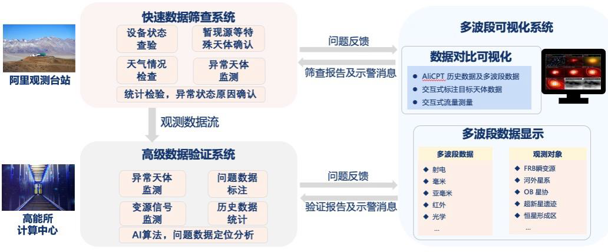
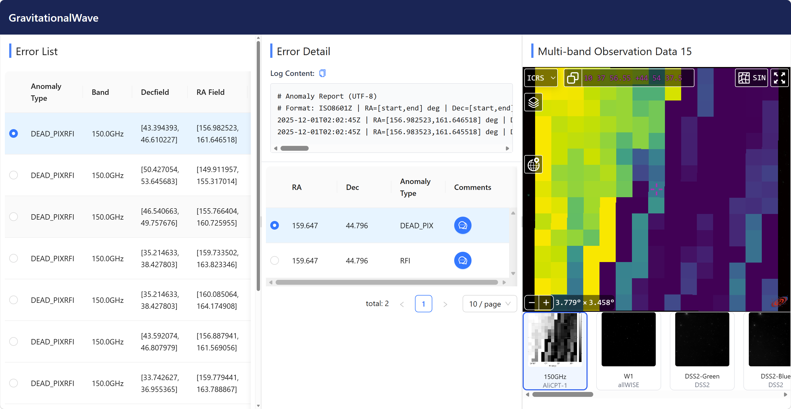
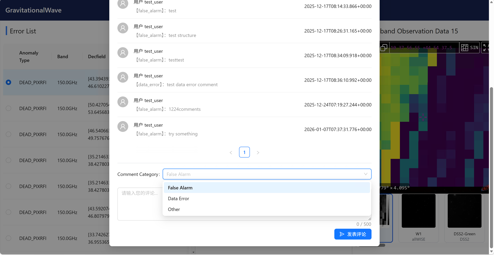

# 面向 AliCPT 的多波段可视化系统

> 基于《多波段可视化系统技术方案》与现有界面原型整理的系统说明文档。当前版本重点说明系统定位、业务边界、核心流程与技术架构；由于后端仓库未在本地获取到，代码级模块映射待接入源码后补充。

## 1. 系统概述

多波段可视化系统面向 AliCPT 观测数据处理流程，承担“**数据质量展示 + 人工复核协同 + 多波段交叉判读**”职责。

系统不替代快筛系统和高级验证系统的数值分析能力，而是接收它们输出的异常结果对象，在统一工作台上完成：

- 异常报告检索与定位
- AliCPT 候选天区与多波段数据联动展示
- 人工判读、评论、复核归档
- 上游问题反馈与下游结论沉淀

核心目标是把“发现异常 -> 查看细节 -> 对比多波段证据 -> 形成复核结论”压缩到单一页面内完成，支撑小时级异常识别与科学判读。

## 2. 建设背景

- AliCPT 每日持续产生时序观测数据，传统人工检查已无法满足实时处理需求。
- 原初引力波相关信号微弱，容易被前景天体、设备状态、天气影响或射频干扰掩盖，必须依赖射电、红外、光学等多波段联合判读。
- 现有通用工具如 CARTA、Aladin 更偏单点分析，不适合直接挂接到 AliCPT 的自动化业务流水线。

因此，本系统的价值不在于“再做一套图像浏览器”，而在于把上游分析输出、NADC 巡天数据、人工协作复核三者整合成一条可运行的业务闭环。

## 3. 系统边界

### 3.1 上游系统

- 快速数据筛查系统：负责基础异常检测、异常打标、设备状态与天气相关问题初筛。
- 高级数据验证系统：负责复杂异常确认、变源监测、历史统计和深层分析。

### 3.2 本系统职责

- 接收异常报告与候选天区对象
- 解析 RA、Dec、FOV 等查询参数
- 触发或复用多波段数据检索结果
- 统一展示 AliCPT 图像与巡天数据
- 保存人工评论、复核分类与最终结论

### 3.3 非职责范围

- 不负责替代上游异常检测算法
- 不负责科学计算型深度分析
- 不直接承担观测原始数据生产
- 不把数据下载、调度、展示、结论管理混写在同一层

## 4. 业务视图

从业务视角看，系统位于快筛系统与高级验证系统之后，是一层面向人工复核的“证据组织与交互分析平台”。

系统输入：

- 快筛异常报告
- 高级验证产品
- NADC 多波段巡天数据

系统输出：

- 多波段可视化视图
- 人工判读结论
- 复核评论与标注反馈

## 5. 核心领域对象

为避免职责交叉，系统建议围绕以下领域对象组织：

- `AnomalyReport`
  - 表示一次异常报告集合
  - 典型字段：报告编号、观测批次、时间范围、来源系统、统计摘要
- `AnomalyRecord`
  - 表示报告中的单条异常记录
  - 典型字段：异常类型、RA 区间、Dec 区间、Band、关联图像、状态
- `SkyRegionQuery`
  - 表示一次标准化天区查询请求
  - 典型字段：中心坐标、FOV、目标数据源、坐标系、分页与过滤条件
- `SurveyDataset`
  - 表示某个数据源返回的多波段结果集
  - 典型字段：survey、band、文件路径、缩略图、FITS 元数据、缓存状态
- `ReviewComment`
  - 表示人工判读意见
  - 典型字段：分类、评论内容、用户、时间、关联异常记录
- `ReviewConclusion`
  - 表示复核后的最终结论
  - 典型字段：结论类型、复核状态、反馈建议、是否归档

建议以后端对象为核心组织接口，而不是散乱的参数拼接，这样更利于数据质量控制、索引扩展与后续多系统协作。

## 6. 核心业务能力

### 6.1 异常报告管理

- 分页展示异常报告与异常记录
- 支持按异常类型、坐标区间、观测信息等多维组合查询
- 支持查看原始日志、统计特征和关联记录

### 6.2 多波段对比分析

- 联动加载 AliCPT 候选区域与巡天数据
- 支持多图层叠加、透明度调节、缩放平移同步
- 支持任意坐标定位和单波段切换

### 6.3 自动检索与数据入库

- 根据异常对象自动构建 NADC 查询参数
- 支持异步并行下载 FITS 或 PNG 数据
- 下载后完成文件落盘、元数据入库与索引关联

### 6.4 人工复核与归档

- 支持对异常记录补充标准化结论
- 支持 `False Alarm`、`Data Error`、`Other` 等复核分类
- 支持评论沉淀、状态更新与结果归档

## 7. 交互界面

当前界面已经形成三栏工作布局：

- 左侧：异常报告列表，定位待复核对象
- 中部：异常详情、日志与记录列表
- 右侧：AliCPT 与多波段观测数据联动展示

这类布局的优势是把“列表定位、详情判断、图像对比”收敛到同一工作面，减少研究人员在多个工具之间切换的成本。

## 8. 评论与判读闭环

人工复核不是附属功能，而是系统闭环的关键一环。当前原型已经支持：

- 对异常记录添加评论
- 选择标准化评论分类
- 形成最终分析结论
- 支持后续接入多人协作与外部通知流程

## 9. 技术架构

系统采用前后端分离、在线查询与离线调度结合的架构。

### 9.1 分层设计

- 表现层 `Presentation Layer`
  - 负责前端界面、多波段图像展示、交互分析工具
- 服务层 `Service Layer`
  - 负责 RESTful API、查询编排、数据管理、权限控制
- 数据层 `Data Layer`
  - 负责 AliCPT 产品、多波段数据、检索索引与缓存
- 任务调度层 `Task Scheduling Layer`
  - 负责自动下载、定期更新、异常触发任务编排

### 9.2 技术选型

- `Spring Boot`
  - 后端核心框架，承载稳定的 API 服务
- `Elasticsearch`
  - 负责异常报告、元数据与检索结果的高效索引
- `Redis`
  - 负责高频查询缓存，降低重复查询与重复下载
- `DolphinScheduler`
  - 负责任务编排与自动化调度
- `Aladin Sky Atlas`
  - 负责当前前端天文图像可视化与坐标联动
- `WebGL`
  - 负责多图层叠加、透明度控制与高效渲染

## 10. 数据流程

系统数据处理链路如下：

1. 上游快筛系统或高级验证系统推送异常报告。
2. 后端解析 `RA`、`Dec`、`FOV`、观测时间、异常类型等关键字段。
3. 服务层构建标准化 `SkyRegionQuery` 对象。
4. 调度层并行调用 NADC 接口检索目标天区的多波段数据。
5. 结果文件按统一规则落盘，元数据写入 Elasticsearch。
6. 前端按异常记录加载关联的 AliCPT 图像与多波段图层。
7. 用户完成复核、标注、评论和归档，结论回流到业务系统。

### 10.1 当前支持的数据源

- `2MASS`：J / H / Ks 近红外波段
- `WISE / allWISE`：W1 - W4 红外波段
- `DSS2`：Blue / Red / IR 光学波段
- `NVSS`：1.4GHz 射电波段
- `LEGACY Survey`：g / r / i / z 光学波段

## 11. 非功能要求

### 11.1 数据质量优先

- 查询参数必须标准化，不允许前端直接拼接任意坐标字符串
- 异常记录、多波段文件、评论结论之间必须保持稳定关联
- 下载失败、空结果、重复结果、索引不一致都需要可追踪状态

### 11.2 性能要求

- 高频异常查询应优先走 Elasticsearch + Redis
- 多波段下载必须异步化，避免阻塞在线查询链路
- 图像展示与数据下载解耦，优先返回可展示结果

### 11.3 可扩展性要求

- 数据源接入通过统一数据访问模型完成
- 调度编排与在线 API 分离，避免互相耦合
- 评论、复核、通知应保持独立领域能力，方便后续对接高能所用户系统与预警系统

## 12. 部署建议

建议按“双中心协同”思路部署：

- 阿里观测站侧：靠近观测与快筛链路，承担快速异常发现与展示接入
- 高能所侧：靠近高级验证与科学分析环境，承担复杂复核与联合分析

系统支持三种运行形态：

- 子系统独立运行
- 平台内流水线式联动运行
- 阿里与高能所分布式协同运行

## 13. 演进路线

### 短期

- 优化异常报告展示逻辑与界面布局
- 完善异常标注与评论管理能力
- 调研并接入 `JS9`，增强单数据精细展示能力

### 中期

- 扩展 `SDSS`、`GALEX` 等高质量巡天数据集
- 完善统一数据访问模型
- 与高能所调度系统打通

### 长期

- 接入 AliCPT 常态化数据流程
- 支撑 1 小时内异常初筛打标
- 对接告警与快报流程，实现分级预警

